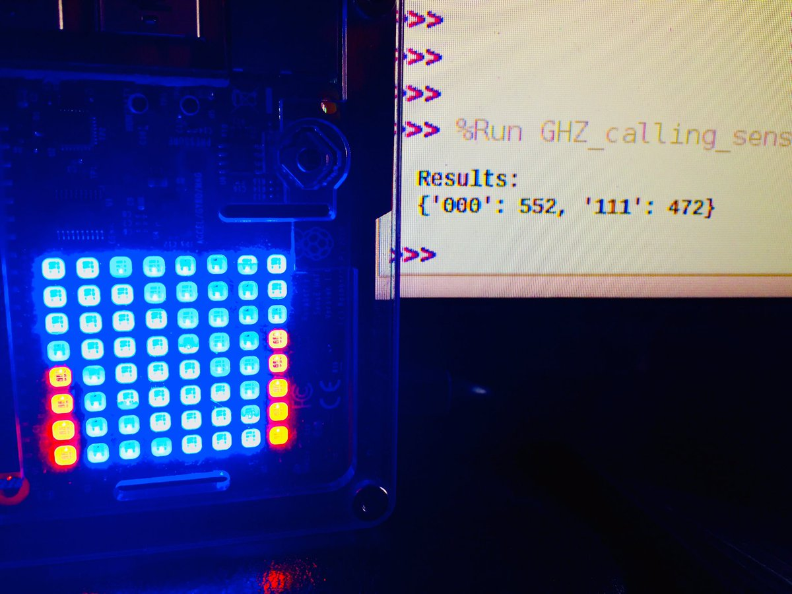

# Qrasp - Two and three qubit Qiskit user interface on Raspberry PI SenseHat
A set of Python scripts that uses [Qiskit](https://qiskit.org) to run two or three qubit quantum circuits and display the results as bar graphs on a Raspberry PI SenseHat 8x8 LED display.



## Updates
- March 2019 - V0.2 with updates to run Qrasp against actual IBM Q hardware.  
- January 2019 - Initial version 0.1  

## Requirements  

These scripts were developed and tested with the following hard- and software:
- Hardware
   - Raspberry PI 2B (a21041)
   - Raspberry Pi Sense HAT (v1.0)
- Software
  - Raspbian GNU/Linux 9 (stretch)
  - sense-hat 2.2.0
  - [qiskit](https://qiskit.org/) 0.6.1 (seems to run fine on 0.7) 
**Note:** This software was developed on qiskit v0.6.1. The qiskit-returned results dictionary differs between v0.6 and v0.7. If you are running Qrasp on qiskit v0.7 or higher you must uncomment a line in *qc_sensehat_func.py* to override the v0.6 processing. See the comment in that file. 

### What you can do with this version...
This version lets you run four different quantum scripts that demo superposition and entanglement with two and three qubits.

You use the joystick to select the script to run:
- Up: Two qubit Bell state (entanglement)
- Down: Three qubit GHZ state (entanglement)
- Right: Three qubit superposition
- Left: Two qubit superposition
- Push: Set the backend (AER 'qasm_simulator' or IBMQ 'ibmqx2' configurable in main_controller.py)

### Planned for the future
- Snazzy 'quantum calculations running' animation on the 8x8 LED display while the simulation is running or while waiting for the hardware backend to return results.
- Status and queue indicator for running against IBM Q hardware.
- Auto selector for best IBM Q hardware.
- Use built-in SenseHat emulator instead of hardware SenseHat.
- Color gradients between the red and blue LEDs to indicate results with finer granularity than 1/8 or the bar.
- More...

## Contents
Qrasp consists of the following scripts:
1. main_controller.py  
This script loads the required libraries, and uses the SenseHat joystick to select one of the Quantum programs.

2. Quantum program scripts  
These scripts creates and executes the quantum programs, and then calls the display script with the results. For more information about the circuits and how to construct your own, see the [IBM Q Experience Beginners Guide](https://quantumexperience.ng.bluemix.net/qx/tutorial?sectionId=beginners-guide&page=introduction).
   - q2_calling_sense_func.py  
Python function that creates a simple, two qubit quantum cirquit and sets up and measures each qubit in a superposition state.
     ```
                      ┌───┐┌─┐
     q0_0: |0>────────┤ H ├┤M├
              ┌───┐┌─┐└───┘└╥┘
     q0_1: |0>┤ H ├┤M├──────╫─
              └───┘└╥┘      ║
      c0_0: 0 ══════╬═══════╩═
                    ║         
      c0_1: 0 ══════╩═════════
     ```
   - q3_calling_sense_func.py  
Python function that creates a simple, three qubit quantum cirquit and sets up and measures each qubit in a superposition state.
     ```
                              ┌───┐┌─┐
     q1_0: |0>────────────────┤ H ├┤M├
                      ┌───┐┌─┐└───┘└╥┘
     q1_1: |0>────────┤ H ├┤M├──────╫─
              ┌───┐┌─┐└───┘└╥┘      ║
     q1_2: |0>┤ H ├┤M├──────╫───────╫─
              └───┘└╥┘      ║       ║
      c1_0: 0 ══════╬═══════╬═══════╩═
                    ║       ║         
      c1_1: 0 ══════╬═══════╩═════════
                    ║                 
      c1_2: 0 ══════╩═════════════════
     ```
   - bell_calling_sense_func.py  
Python function that creates a simple, two qubit quantum cirquit and sets up and measures a Bell, or entangled, state.
     ```
              ┌───┐        ┌─┐
     q2_0: |0>┤ H ├──■─────┤M├
              └───┘┌─┴─┐┌─┐└╥┘
     q2_1: |0>─────┤ X ├┤M├─╫─
                   └───┘└╥┘ ║
      c2_0: 0 ═══════════╬══╩═
                         ║    
      c2_1: 0 ═══════════╩════
     ```
   - GHZ_calling_sense_func.py  
Python function that creates a simple, three qubit quantum cirquit and sets up and measures an entangled GHZ state.
     ```
                                     ┌───┐             ┌───┐┌─┐
     q3_0: |0>───────────────────────┤ H ├──■──────────┤ H ├┤M├
                   ┌───┐     ┌───┐┌─┐└───┘  │          └───┘└╥┘
     q3_1: |0>─────┤ H ├──■──┤ H ├┤M├───────┼────────────────╫─
              ┌───┐└───┘┌─┴─┐└───┘└╥┘     ┌─┴─┐┌───┐┌─┐      ║
     q3_2: |0>┤ X ├─────┤ X ├──────╫──────┤ X ├┤ H ├┤M├──────╫─
              └───┘     └───┘      ║      └───┘└───┘└╥┘      ║
      c3_0: 0 ═════════════════════╬═════════════════╬═══════╩═
                                   ║                 ║         
      c3_1: 0 ═════════════════════╩═════════════════╬═════════
                                                     ║         
      c3_2: 0 ═══════════════════════════════════════╩═════════
     ```
3. qc_sensehat_func.py  
Using SenseHat 8x8 display to show bar graph of 2 or 3 qubit Qiskit results dictionaries.


